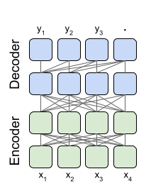

# First Report: Initial Approach to Text Detoxification

## Introduction
In my journey to develop a solution for detoxifying text, I aimed to diminish toxicity in text data while preserving the original intent and content as much as possible. This task required a thorough exploration of various architectures, ideas, and datasets to craft a refined approach to mitigating offensive language.

## Initial Solution Concept
My first attempt at solving this problem was to create a model that targets and eliminates any recognized bad words from the text. This rudimentary model operated under the hypothesis that the direct removal of profanities would lead to a proportional reduction in toxicity.

### Utilization of a Bad Word List
- I implemented a scan for offensive words against a pre-compiled list, removing any matches from the text.
- The list was sourced and imported into the model's environment, providing a reference for text sanitization.

#### Challenges Faced
- **Distortion of Meaning:** The indiscriminate deletion of words occasionally altered the text's original message.
- **Disregard for Context:** The initial approach failed to consider the context, sometimes leading to inappropriate censorship.
- **Lack of Finesse:** This method was overly simplistic and failed to address the nuances of language expression.

## Advancement to T5 Model Architecture
To overcome these challenges, I decided to leverage the T5 (Text-to-Text Transfer Transformer) model, capitalizing on its design for tasks involving text transformation, which closely aligns with the goal of text detoxification.

## Deep Dive into T5 Model Architecture

The T5, or Text-to-Text Transfer Transformer, architecture stands out due to its universal approach to handling various Natural Language Processing (NLP) tasks. The fundamental premise of T5 is the conversion of all NLP problems into a text-to-text framework, where the input and output are always strings of text. This versatility makes T5 an ideal candidate for the task of text detoxification.

### Core Design Features

- **Encoder-Decoder Framework:** T5 follows the classic transformer model layout with an encoder that processes the input text and a decoder that generates the output. The encoder maps an input sequence to a sequence of continuous representations, which the decoder then converts into an output sequence.

- **Pre-training Objectives:** T5 is pre-trained on a large corpus using a variant of the denoising auto-encoder objective, where it learns to reconstruct the original text from a corrupted version. This pre-training enables T5 to grasp the underlying structure of language.

- **Fine-Tuning Flexibility:** The architecture supports fine-tuning on specific tasks by adjusting the model's weights to perform a wide range of tasks without substantial modifications to the core model.

### Advanced Techniques Incorporated

- **Scaled Dot-Product Attention:** At the heart of T5 lies the attention mechanism, which allows the model to focus on different parts of the input sequence when predicting each part of the output sequence, leading to a nuanced understanding of context.

- **Causal Decoding:** The model generates text sequentially, predicting the next token in the sequence given the previous tokens, allowing for coherent and contextually relevant text generation.

- **Relative Positional Encodings:** T5 incorporates positional information by encoding the relative positions of tokens in the input, which is crucial for understanding the order and structure of language.

## Fine-Tuning Strategy

I selected the T5 model for its adaptability in handling diverse text transformation scenarios. The model underwent fine-tuning with a dataset curated specifically for the detoxification task, which equipped it to distinguish between toxic and non-toxic textual nuances. Throughout the fine-tuning phase, I monitored performance indicators such as loss metrics to ensure the model was learning effectively.

## Anticipated Improvements

- **Recognition of Context:** T5's design enables it to appreciate the context within which words are used, allowing for accurate preservation of meaning during detoxification.
- **Custom Adaptability:** By fine-tuning the T5 model with a specialized dataset, it becomes better suited to address the particularities of detoxifying text.
- **Nuanced Detoxification:** In contrast to the base model, T5 is designed to manage complex language intricacies, offering a more sophisticated and subtle detoxification process.

## Results and Observations

Here, I will present the comparative results showing the effectiveness of both the base model and the T5 model in terms of style transfer accuracy and cosine similarity.

| Model            | Style Transfer Accuracy | Mean Cosine Similarity |
|------------------|-------------------------|------------------------|
| Deletion Model   | 0.48                    | 0.98                   |
| T5 Based Model   | 0.75                    | 0.87                   |

## Conclusion

My initial method of simply deleting bad words from the text was informative but inadequate. It helped me realize the need for a solution that could handle the complexities of language with more finesse. The advanced solution using the T5 model represents a significant step towards a context-aware, adaptable, and nuanced text detoxification process. Subsequent reports will delve into the detailed performance metrics and evaluations of the fine-tuned T5 model.
