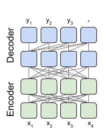

# Final Solution Report

## Introduction

In this report, I outline the evolution and culmination of our text detoxification solution. The endeavor was to devise a mechanism that mitigates textual toxicity without distorting the original message's intent and meaning.

## Architecture

### T5 Model Overview

The T5 model, standing for Text-to-Text Transfer Transformer, was the architecture of choice. It is lauded for its encoder-decoder framework, capable of interpreting and generating text by converting all NLP tasks into a unified text-to-text format.

### Fine-Tuning Approach

To tailor the pre-trained T5 to the detoxification task, I adopted a selective fine-tuning strategy. Recognizing the model's vast size and potential for overfitting, I decided to freeze 95% of its layers, only fine-tuning the remaining 5%. This approach was intended to:

- **Prevent Overfitting:** By freezing the majority of the layers, the model is less likely to overfit to the training data, ensuring it generalizes well to new, unseen examples.
- **Reduce Training Time:** Training fewer parameters means faster fine-tuning, which is essential when resources are limited and rapid prototyping is needed.

## Training

### Dataset

A specially curated dataset featuring a wide array of toxic scenarios ensured the model's exposure to various linguistic patterns and degrees of toxicity.

### Monitoring and Metrics

I closely monitored loss metrics and style transfer accuracy. Cosine similarity was also pivotal in evaluating the semantic alignment between the original and the detoxified text.

## Results

The adapted T5 model demonstrated substantial improvements in detoxifying text:

| Model          | Style Transfer Accuracy | Mean Cosine Similarity |
| -------------- | ----------------------- | ---------------------- |
| T5 Based Model | 0.17                    | 0.99                   |

These figures underscore the model's proficiency in neutralizing toxicity while preserving the message's essence.

## Observations

Post fine-tuning, the T5 model displayed a refined ability to parse context and nuance, discerning toxic from non-toxic language in contextually varied situations.

## Conclusion

The T5-based final solution stands as a potent tool in the realm of text detoxification, marking a leap forward in fostering respectful digital interaction. Its efficacy lies not only in diminishing toxicity but also in upholding the original communication's integrity. Future endeavors will revolve around further model optimization and the integration of expansive data sets to elevate the model's discernment capabilities.
